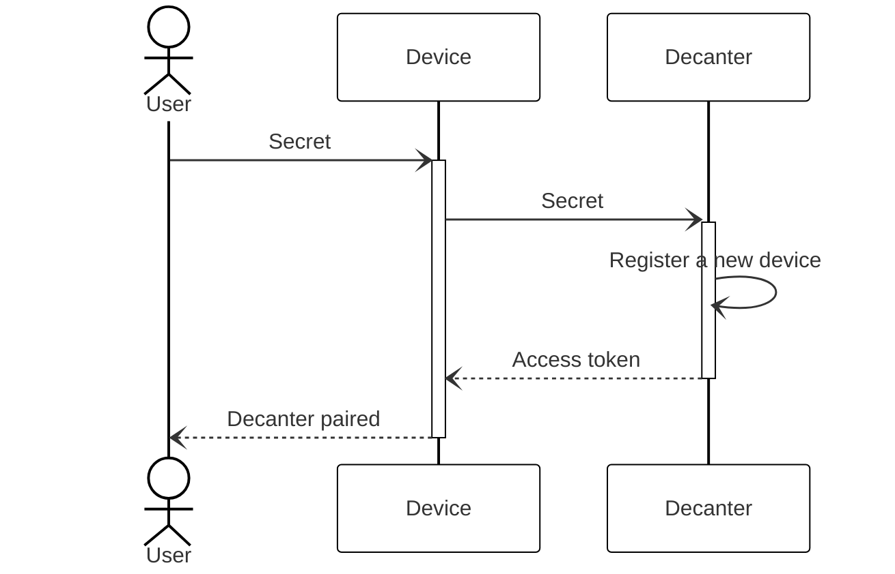
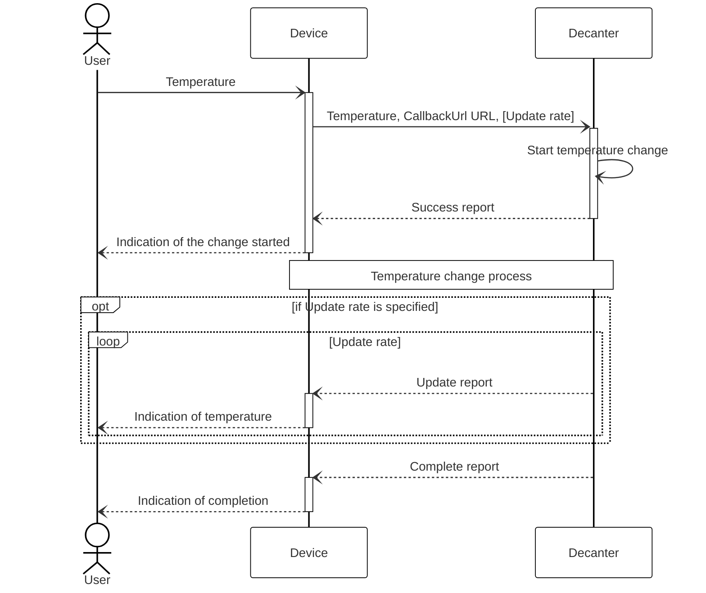
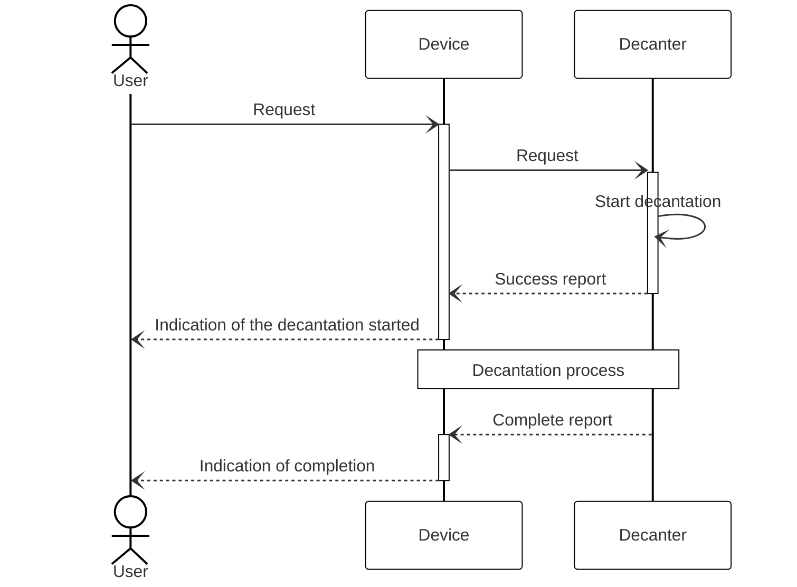

# Overview

This specification contains details on interactions between a digital decanter and remote devices over the HTTP protocol.

A single decanter can be powered by many devices and a device can connect to many decanters.

# Best Practices

## Authentication

Any request but the authorization request itself requires providing an access token as a bearer token. To authenticate a request, place the bearer token to the request's header.

To obtain an access token, send a [POST /api/1/device](#tag/Authentication/operation/register_device) request with a secret provided with the decanter on a physical medium.

The workflow of authentication is given in the sequence diagram below.

To revoke an access token, send a [DELETE /api/1/device](#tag/Authentication/operation/delete_device) request.

## Changing Temperature

To change the temperature of wine, send a [POST /api/1/temperature](#tag/Temperature/operation/set_temperature) with desired temperature and intensity of update reports (optional). The decanter will emit reports on temperature updates throughout the process and the final report after the process is complete.

The workflow of changing the temperature is given in the sequence diagram below.

Sending a request during an ongoing process sets a new target temperature. To stop an ongoing process, send a [DELETE /api/1/temperature](#tag/Temperature/operation/cancel_temperature) request.

## Decantation

To decant wine, send a [POST /api/1/decantation](#tag/Decantation/operation/start_decantation). The decanter will emit a report after the process is complete.

The workflow of decantation is given in the sequence diagram below.

Sending a repeated request cannot alter the decanter behavior—to stop an ongoing process, send a [DELETE /api/1/decantation](#tag/Decantation/operation/cancel_decantation) request.